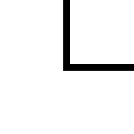

## `block-cipher` is a text-to-image encoding scheme.

Users input a "key" and some words separated by spaces. Words are encoded 3 letters at a time into large blocks. The large blocks are divided into three sub-blocks, one a 1x2 rectangle and two 1x1 squares. The keys takes the numbers 1 - 4 and depending on the value, swaps around sub-blocks within a large block. The effect of the key is rather minor and the key can be pretty easily read from the image directly.

Players are meant to start small, trying short messages like "a", then "b", "c", and so on. A pattern of changes in the sub-blocks should become apparent. Using a key of "1" the top-left square sub-block will change in this repeating sequence:

    

When this block roles over the next square sub-block changes. It follows this sequence:

    

When the second square sub-block rolls over the larger 1x2 sub-block then follows this sequence:

      

The three sub-blocks symbols act as base 5, 5, and 7 digits. Once they've cycled through, 90 degree rotations are added to the first sub block. Then 90 degree to the second. Then 180 degree to the 3rd. Finally when all those rotations cycle the entire block is rotated by 90 degrees.

In all a large block encodes a mixed-radix number of base 5, 5, 7, 4, 4, 2, 4 where the 5, 5, 7 part are the symbols of the three different sub-blocks, the 4, 4, 2 part are the rotations of the sub-blocks, and then the final 4 is the rotation of the whole block. This enables each large block to encode log(5 * 5 * 7 * 4 * 4 * 2 * 4) / log(27) = 3.039 base-27 digits. This is how the each large block is able to encode 3 letters at once. a = 1, b = 2, ... z = 26. The digit zero is skipped and is only used as padding in the case where fewer than 3 letters need to be encoded.

There is a circular mark in the border of the large-block which shows both the rotation of the large block, as well as whether the key digit has flipped the 1x2 sub-block with the two 1x1 square sub-blocks. The rotation of the large-block must be "undone" before reading the rotations of sub blocks. That is, the rotations "stack".

## Reading the key

By experimenting with the keys 1 through 4 you can determine that:

- 1: no effect
- 2: swap position of square sub-blocks
- 3: swap 1x2 sub block with square sub-blocks
- 4: Same effect as 2 and 3 (double swap)

Here is an annotated flag showing the key digit for every large block:

As you can see, the key is "121314".

## Reading the large-block rotation

The half-circle bump in the border can be used to see how the whole block has been rotated. It starts at the top and rotates clockwise to the right, bottom, and finally left side.

Here is an annotated flag showing the rotation of the large blocks:

By chance, the final rotation value "3" isn't used because none of the 3-letter blocks end with high a enough letter in the alphabet to need it.

## Reading the sub-blocks

The sub-blocks each contribute two digits. The first is the block number itself, and the second is the block rotation. It is easy to see at a glance which sub block each is. Seeing how they are rotated is a bit mind-bending as you first need to mentally "undo" the large block rotation.

Here are all of the sub-blocks annotated with their number in large font, and their rotation in small font.

    #!/usr/bin/env python3
    
    
    def block_to_n(bl):
    
        radix = (5, 5, 7, 4, 4, 2, 4)
    
        n = 0
    
        for i in range(len(radix) - 1, -1, -1):
            n *= radix[i]
            n += bl[i]
    
        return n

    
    def num_to_let(num):
    
        if num == 0:
            return ''
    
        return chr(ord('a') + (num - 1))
    
    
    def n_to_trip(n):
    
        l1num = n % 27
        n //= 27
        l2num = n % 27
        n //= 27
        l3num = n
    
        return num_to_let(l1num) + num_to_let(l2num) + num_to_let(l3num)
    
    
    def decode_word(bll):
    
        word = ''
        for bl in bll:
            n = block_to_n(bl)
            #print(f"Got {n} for {bl}")
            word += n_to_trip(n)
    
        return word
    
    
    w1_bll = [(4, 3, 4, 3, 2, 0, 0),
              (2, 0, 6, 3, 2, 0, 2),
              (4, 1, 1, 3, 2, 1, 1),
              (2, 0, 2, 1, 1, 1, 0),
              (3, 1, 3, 2, 0, 1, 2)]
    w1 = decode_word(w1_bll)
    
    w2_bll = [(2, 4, 3, 2, 1, 0, 2),
              (1, 2, 4, 3, 1, 1, 0),
              (2, 3, 3, 3, 2, 0, 2),
              (2, 2, 6, 1, 1, 1, 2),
              (0, 4, 4, 0, 3, 1, 1)]
    w2 = decode_word(w2_bll)
    
    w3_bll = [(2, 1, 4, 0, 0, 1, 2),
              (4, 2, 4, 0, 3, 1, 1),
              (2, 0, 4, 2, 3, 1, 0),
              (1, 2, 0, 3, 1, 0, 0),
              (0, 1, 6, 0, 0, 0, 0)]
    w3 = decode_word(w3_bll)
    
    w4_bll = [(0, 2, 0, 3, 1, 0, 0),
              (4, 0, 1, 1, 2, 1, 1),
              (0, 3, 2, 3, 1, 0, 0),
              (3, 4, 6, 3, 3, 1, 1),
              (4, 2, 1, 2, 0, 1, 1)]
    w4 = decode_word(w4_bll)
    
    w5_bll = [(4, 4, 1, 3, 3, 1, 1),
              (3, 4, 2, 0, 2, 1, 2),
              (4, 0, 5, 0, 1, 0, 0),
              (3, 4, 6, 3, 3, 1, 1),
              (4, 2, 0, 0, 0, 0, 0)]
    w5 = decode_word(w5_bll)
    
    
    print(f"CTF{{{w1}_{w2}_{w3}_{w4}_{w5}}}")

Which when run results in the flag:

    $ ./decode_blocks.py
    CTF{subterrenaceous_hyperencryption_misconfigurate_transmutational_deobfuscation}

## Alternative solution method

Instead of fully understanding every detail of the encoding and doing math, players may simply observe that each block corresponds to 3 letters and then manually search / brute force each block one, at a time. As you get more familiarized with the magnitude of the effect each of the 3 letters has on the large block, it is possible to rather quickly narrow-in on the correct 3-letters. Once a bit of the word is already known, this can aid in more quickly helping to guess other portions of the word.

