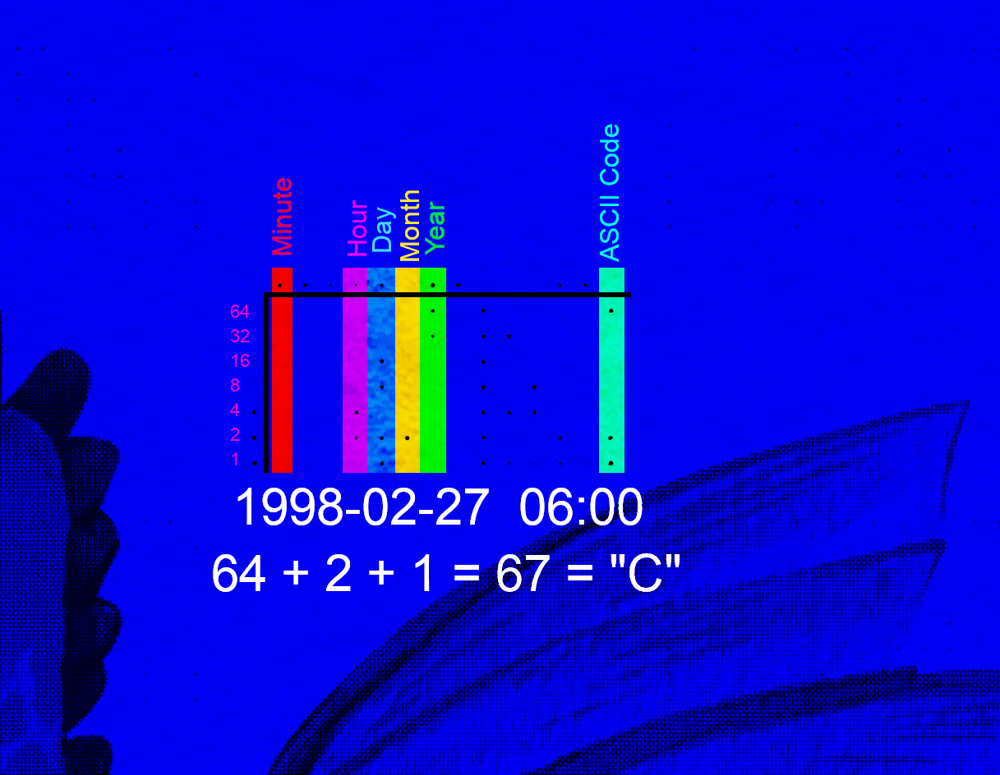

## How to solve
This level was inspired by [Pokemon protoype cards](https://www.elitefourum.com/t/many-of-the-pokemon-playtest-cards-were-likely-printed-in-2024/52421).

Cards have been "printed" with a printer that adds tiny yellow [tracking dots](https://en.wikipedia.org/wiki/Printer_tracking_dots) in the [Xerox DocuColor grid format](https://w2.eff.org/Privacy/printers/docucolor/).

Dots are most obvious in the blue color channel. Here is an overlay of one card showing this:

* There are 29 cards - for each letter of the alphabet, `{`,`}` and one special card for `f` (has signature on it).
* The final column of each card encodes the 7-bit ASCII letter
* Cards printed in 1998 are authentic. Cards printed in 2024 are not.
* Of these only the authentic cards count towards the flag `CTF{plsverifynow}`
* If you order the authentic cards by print time, you will get the flag
