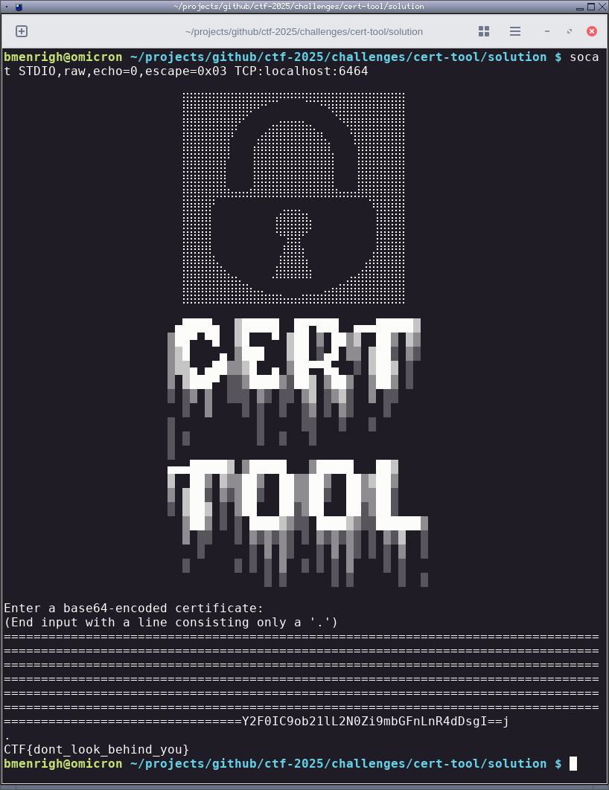

## `cert-tool` -- a base64 decoding logic flaw when handling padding

`cert-tool` takes a base64 encoded TLS cert and runs it through OpenSSL to print cert details. The provided cert gets base64-decoded and then passed via STDIN to the following OpenSSL command `openssl x509 -in /dev/stdin -inform DER -text -noout`

The logic issue is that when decoding base64, the function tracks offsets in bits and when it encounters a padding character `=` it subtracts 2 from the bit offset. Technically each `=` does mean to ignore 2 bits however this would only be safe if there was a check to make sure padding only ever came last.

In memory the command string buffer is 128 bytes and imediately preceedes the 4096 byte decoded input buffer. By backing up the bit pointer by 128 bytes (512 `=`) the base64 input will be decoded on top of the command string.

The provided `solve.py` constructs this payload to cat the flag:

    ================================================================================================================================================================================================================================================================================================================================================================================================================================================================================================================================Y2F0IC9ob21lL2N0Zi9mbGFnLnR4dDsgI==j

The `[...]I==j` part at the end just backs up the pointer to prevent writing past the desired byte and partially corrupting the end of the string. It's just a nice optimization to avoid some junk.

