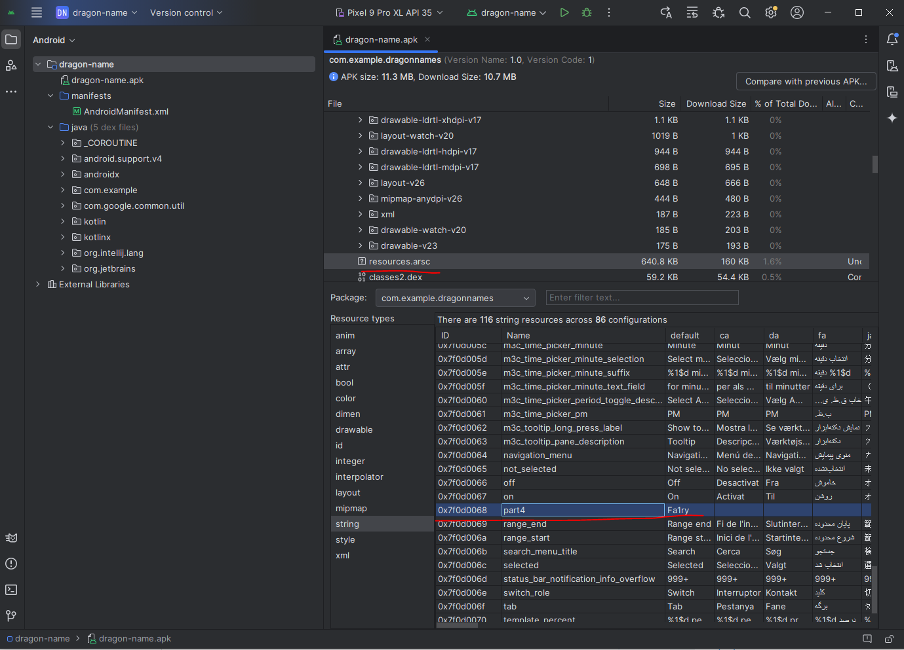

The app generates the flag in the createFlag() function which does the following, 
```
 fun createFlag(): String {
        val part1 = rot13("PGS")
        val b64 = Base64.Default.decode("dzNhaw==")
        val part2 = b64.decodeToString()
        val x = 10 % 2
        val part3 = "T$x"
        val part4 = resources.getString(R.string.part4)
        val y = if (2 < 3) 3 else 0
        val part5 = "Typ$y"
        val flag = "$part1{$part2$part3$part4$part5}"
        return flag
  }
  
 ```

Here is what the function step-by-step:
## Part 1
"PGS" is ROT13 encoded.
'P' + 13 = 'C'
'G' + 13 = 'T'
'S' + 13 = 'F'
Therefore, part1 ("PGS" after rot13) is "CTF".

## Part 2
The Base64 string "dzNhaw==" is decoded.
"dzNhaw==" decodes to "w3ak".
Therefore, part2 is "w3ak".


## Part 3
The code creates the string "T0".
Therefore, part3 is "T0".

## Part 4
`getResources().getString(R.string.part4):`
This retrieves the string resource with the ID R.string.part4.
Which is "Fa1ry"
Therefore, part4 is "Fa1ry"

## Part 5
"Typ" + 3:
The code creates the string "Typ3".
Therefore, part5 is "Typ3".

## Flag 

The code concatenates all the parts:
"CTF" + "{" + $part1 + $part2 + $part3 + $part4 + $part5 + "}"
Therefore, the flag is: "CTF{w3akT0Fa1ryTyp3}".

## How to reverse the app
### Apk tool 
* Use apktool to unpack the apk `java -jar apktool_2.11.0.jar d dragon-names.apk`
* The relevant Smali code is in `smali_classes4\com\example\dragonnames\MainActivity`
```
.method public final createFlag()Ljava/lang/String;
    .locals 10

    .line 28
    const-string v0, "PGS"

    invoke-virtual {p0, v0}, Lcom/example/dragonnames/MainActivity;->rot13(Ljava/lang/String;)Ljava/lang/String;

    move-result-object v0

    .line 29
    .local v0, "part1":Ljava/lang/String;
    sget-object v1, Lkotlin/io/encoding/Base64;->Default:Lkotlin/io/encoding/Base64$Default;

    move-object v2, v1

    check-cast v2, Lkotlin/io/encoding/Base64;

    const-string v1, "dzNhaw=="

    move-object v3, v1

    check-cast v3, Ljava/lang/CharSequence;

    const/4 v6, 0x6

    const/4 v7, 0x0

    const/4 v4, 0x0

    const/4 v5, 0x0

    invoke-static/range {v2 .. v7}, Lkotlin/io/encoding/Base64;->decode$default(Lkotlin/io/encoding/Base64;Ljava/lang/CharSequence;IIILjava/lang/Object;)[B

    move-result-object v1

    .line 30
    .local v1, "b64":[B
    invoke-static {v1}, Lkotlin/text/StringsKt;->decodeToString([B)Ljava/lang/String;

    move-result-object v2

    .line 31
    .local v2, "part2":Ljava/lang/String;
    const/4 v3, 0x0

    .line 32
    .local v3, "x":I
    new-instance v4, Ljava/lang/StringBuilder;

    invoke-direct {v4}, Ljava/lang/StringBuilder;-><init>()V

    const-string v5, "T"

    invoke-virtual {v4, v5}, Ljava/lang/StringBuilder;->append(Ljava/lang/String;)Ljava/lang/StringBuilder;

    move-result-object v4

    invoke-virtual {v4, v3}, Ljava/lang/StringBuilder;->append(I)Ljava/lang/StringBuilder;

    move-result-object v4

    invoke-virtual {v4}, Ljava/lang/StringBuilder;->toString()Ljava/lang/String;

    move-result-object v4

    .line 33
    .local v4, "part3":Ljava/lang/String;
    invoke-virtual {p0}, Lcom/example/dragonnames/MainActivity;->getResources()Landroid/content/res/Resources;

    move-result-object v5

    sget v6, Lcom/example/dragonnames/R$string;->part4:I

    invoke-virtual {v5, v6}, Landroid/content/res/Resources;->getString(I)Ljava/lang/String;

    move-result-object v5

    const-string v6, "getString(...)"

    invoke-static {v5, v6}, Lkotlin/jvm/internal/Intrinsics;->checkNotNullExpressionValue(Ljava/lang/Object;Ljava/lang/String;)V

    .line 34
    .local v5, "part4":Ljava/lang/String;
    const/4 v6, 0x3

    .line 35
    .local v6, "y":I
    new-instance v7, Ljava/lang/StringBuilder;

    invoke-direct {v7}, Ljava/lang/StringBuilder;-><init>()V

    const-string v8, "Typ"

    invoke-virtual {v7, v8}, Ljava/lang/StringBuilder;->append(Ljava/lang/String;)Ljava/lang/StringBuilder;

    move-result-object v7

    invoke-virtual {v7, v6}, Ljava/lang/StringBuilder;->append(I)Ljava/lang/StringBuilder;

    move-result-object v7

    invoke-virtual {v7}, Ljava/lang/StringBuilder;->toString()Ljava/lang/String;

    move-result-object v7

    .line 36
    .local v7, "part5":Ljava/lang/String;
    new-instance v8, Ljava/lang/StringBuilder;

    invoke-direct {v8}, Ljava/lang/StringBuilder;-><init>()V

    invoke-virtual {v8, v0}, Ljava/lang/StringBuilder;->append(Ljava/lang/String;)Ljava/lang/StringBuilder;

    move-result-object v8

    const-string v9, "{"

    invoke-virtual {v8, v9}, Ljava/lang/StringBuilder;->append(Ljava/lang/String;)Ljava/lang/StringBuilder;

    move-result-object v8

    invoke-virtual {v8, v2}, Ljava/lang/StringBuilder;->append(Ljava/lang/String;)Ljava/lang/StringBuilder;

    move-result-object v8

    invoke-virtual {v8, v4}, Ljava/lang/StringBuilder;->append(Ljava/lang/String;)Ljava/lang/StringBuilder;

    move-result-object v8

    invoke-virtual {v8, v5}, Ljava/lang/StringBuilder;->append(Ljava/lang/String;)Ljava/lang/StringBuilder;

    move-result-object v8

    invoke-virtual {v8, v7}, Ljava/lang/StringBuilder;->append(Ljava/lang/String;)Ljava/lang/StringBuilder;

    move-result-object v8

    const-string v9, "}"

    invoke-virtual {v8, v9}, Ljava/lang/StringBuilder;->append(Ljava/lang/String;)Ljava/lang/StringBuilder;

    move-result-object v8

    invoke-virtual {v8}, Ljava/lang/StringBuilder;->toString()Ljava/lang/String;

    move-result-object v8

    .line 37
    .local v8, "flag":Ljava/lang/String;
    return-object v8
.end method
```
* The part4 string is in `res/values/strings.xml`
```
<string name="part4">Fa1ry</string>
```

### Android Studio 
* From `File` choose `Profile or Debug APK`
* Relevant code will be in `java > com.example > dragonnames > MainActivity` (Should be same/similar to smali from Apktool)
* Select `resources.arsc`, in `Resource types` choose `string`, scroll to part4 

