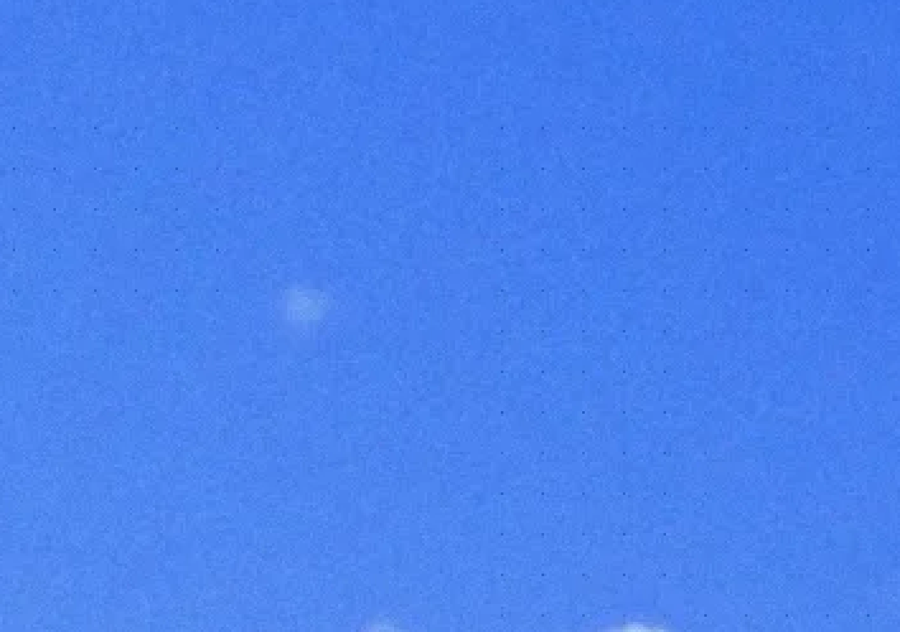
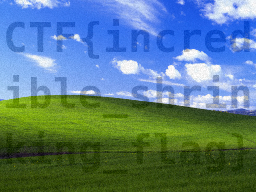

# `nearest-neighbor` -- hiding data such that nearest-neighbor rescaling will reveal it

Players are expected to either notice the name of the challenge is a hint that neirest-neighbor rescaling is needed, or to example the image and spot the grid of darker pixels:

The spacing of the dark pixels is 16 apart in x and y so a nearest-neighbor downscaling by a factor of 16 should select these pixels. The original flag size is 4096x3072 which when shrank by 16 is 256x192.

The rescaling with nearest-neighbor "interpolation" can be done like so:

`$ magick flag.webp -interpolate nearest-neighbor -interpolative-resize 256x192 flag_visible.png`

