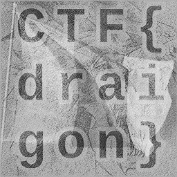

## `oh-say-can-you-see` -- an AI/ML training data extraction challenge

Players are given a pre-trained keras model. The model can be loaded to see the layers and configuration:

    #!/usr/bin/env python3
    
    import sys
    
    from keras.models import load_model
    
    model = load_model(sys.argv[1])
    print(model.get_config())
    model.summary()

This will report the following:

    {'name': 'sequential', 'trainable': True, 'dtype': {'module': 'keras', 'class_name': 'DTypePolicy', 'config': {'name': 'float32'}, 'registered_name': None}, 'layers': [{'module': 'keras.layers', 'class_name': 'InputLayer', 'config': {'batch_shape': (None, 256, 256, 1), 'dtype': 'float32', 'sparse': False, 'ragged': False, 'name': 'input_layer'}, 'registered_name': None}, {'module': 'keras.layers', 'class_name': 'Conv2D', 'config': {'name': 'conv2d', 'trainable': True, 'dtype': {'module': 'keras', 'class_name': 'DTypePolicy', 'config': {'name': 'float32'}, 'registered_name': None}, 'filters': 32, 'kernel_size': (3, 3), 'strides': (1, 1), 'padding': 'valid', 'data_format': 'channels_last', 'dilation_rate': (1, 1), 'groups': 1, 'activation': 'relu', 'use_bias': True, 'kernel_initializer': {'module': 'keras.initializers', 'class_name': 'GlorotUniform', 'config': {'seed': None}, 'registered_name': None}, 'bias_initializer': {'module': 'keras.initializers', 'class_name': 'Zeros', 'config': {}, 'registered_name': None}, 'kernel_regularizer': None, 'bias_regularizer': None, 'activity_regularizer': None, 'kernel_constraint': None, 'bias_constraint': None}, 'registered_name': None, 'build_config': {'input_shape': [None, 256, 256, 1]}}, {'module': 'keras.layers', 'class_name': 'Flatten', 'config': {'name': 'flatten', 'trainable': True, 'dtype': {'module': 'keras', 'class_name': 'DTypePolicy', 'config': {'name': 'float32'}, 'registered_name': None}, 'data_format': 'channels_last'}, 'registered_name': None, 'build_config': {'input_shape': [None, 254, 254, 32]}}, {'module': 'keras.layers', 'class_name': 'Dense', 'config': {'name': 'dense', 'trainable': True, 'dtype': {'module': 'keras', 'class_name': 'DTypePolicy', 'config': {'name': 'float32'}, 'registered_name': None}, 'units': 4, 'activation': 'linear', 'use_bias': True, 'kernel_initializer': {'module': 'keras.initializers', 'class_name': 'GlorotUniform', 'config': {'seed': None}, 'registered_name': None}, 'bias_initializer': {'module': 'keras.initializers', 'class_name': 'Zeros', 'config': {}, 'registered_name': None}, 'kernel_regularizer': None, 'bias_regularizer': None, 'kernel_constraint': None, 'bias_constraint': None}, 'registered_name': None, 'build_config': {'input_shape': [None, 2064512]}}], 'build_input_shape': (None, 256, 256, 1)}
    Model: "sequential"
    ┏━━━━━━━━━━━━━━━━━━━━━━━━━━━━━━━━━━━━━━┳━━━━━━━━━━━━━━━━━━━━━━━━━━━━━┳━━━━━━━━━━━━━━━━━┓
    ┃ Layer (type)                         ┃ Output Shape                ┃         Param # ┃
    ┡━━━━━━━━━━━━━━━━━━━━━━━━━━━━━━━━━━━━━━╇━━━━━━━━━━━━━━━━━━━━━━━━━━━━━╇━━━━━━━━━━━━━━━━━┩
    │ conv2d (Conv2D)                      │ (None, 254, 254, 32)        │             320 │
    ├──────────────────────────────────────┼─────────────────────────────┼─────────────────┤
    │ flatten (Flatten)                    │ (None, 2064512)             │               0 │
    ├──────────────────────────────────────┼─────────────────────────────┼─────────────────┤
    │ dense (Dense)                        │ (None, 4)                   │       8,258,052 │
    └──────────────────────────────────────┴─────────────────────────────┴─────────────────┘
     Total params: 24,775,118 (94.51 MB)
     Trainable params: 8,258,372 (31.50 MB)
     Non-trainable params: 0 (0.00 B)
     Optimizer params: 16,516,746 (63.01 MB)

Importantly the input shape is `(None, 256, 256, 1)` meaning 256x256 greyscale images. The details of the middle layers don't matter much except that the model after one convolution layer (and a flattening which just re-shapes the 2d array into a 1d array) the model goes straight to 4 outputs (meaning 4 classes). This is a huge explosion in parameters which allows the model to way over-fit. The model should have simply memorized its inputs. By "inverting" the model to find an input that maximizes an output class the training data can be extracted. In other words, this is an input optimization problem.

The general idea is to run gradiant descent on an input until the input maximizes the output for a class. Starting with a blank (black) input is fine. Then add some noise, run prediction, measure the gradiant at each pixel for the desired class, and then adjust the pixels by the gradiant.

Here is some code that does just that:

    #!/usr/bin/env python3
    
    
    import tensorflow as tf
    from keras.models import load_model
    import numpy as np
    
    from PIL import Image
    import os
    import sys
    
    MODEL = load_model(sys.argv[1])
    CLASSES = 4
    IMG_Y_SIZE = 256
    IMG_X_SIZE = 256
    
    # Define the loss object for sparse categorical crossentropy
    loss_object = tf.keras.losses.SparseCategoricalCrossentropy(from_logits=True)
    
    
    def inversion(model, img, learning_rate, class_index):
    
        # Add uniform noise to image so we don't get stuck
        img_np_noise = np.array([np.clip(x + np.random.normal(3, 3), 0, 255) for x in img.numpy()])
    
        # Convert back to tensor
        img_noise = tf.convert_to_tensor(img_np_noise)
    
        # Use gradient tape to watch the image tensor
        with tf.GradientTape() as tape:
           tape.watch(img_noise)
           prediction = model(img_noise, training=False) # run img through the model
           loss = loss_object(tf.convert_to_tensor([class_index]), prediction)
    
           # Calculate gradient of loss for each pixel
           gradient = tape.gradient(loss, img_noise)
    
        # Subtract gradiant scaled by learning rate and clipped to proper range
        img = tf.clip_by_value(img_noise - learning_rate * gradient, 0, 255)
    
        return img
    
    
    # Create output directory if it doesn't exist
    output_dir = "generated_classes"
    os.makedirs(output_dir, exist_ok=True)
    
    for class_index in range(CLASSES):
    
        # Start out with all-black image
        cur_img = tf.convert_to_tensor(np.zeros((1, IMG_X_SIZE, IMG_Y_SIZE, 1)))
    
        for i in range(128):
            cur_img = inversion(MODEL, cur_img, 0.1, class_index)
    
        # Now turn tensor into an image
        img_np = cur_img.numpy()[0, :, :, 0] # Reshape into 2d array
    
        # Normalize values into the range 0 .. 255 by finding min and max
        img_min = img_np.min()
        img_max = img_np.max()
        img_norm = (img_np - img_min) / (img_max - img_min + 1e-8)  # Normalize to [0, 1]
        matrix_uint8 = (img_norm * 255).astype(np.uint8)            # Scale back into greyscale range
    
        pil_img = Image.fromarray(matrix_uint8, mode='L') # Mode L is grey
        output_path = os.path.join(output_dir, f"class_{class_index}.png")
        pil_img.save(output_path)
        print(f"Saved: {output_path}")

The following 4 images are produced:

   

