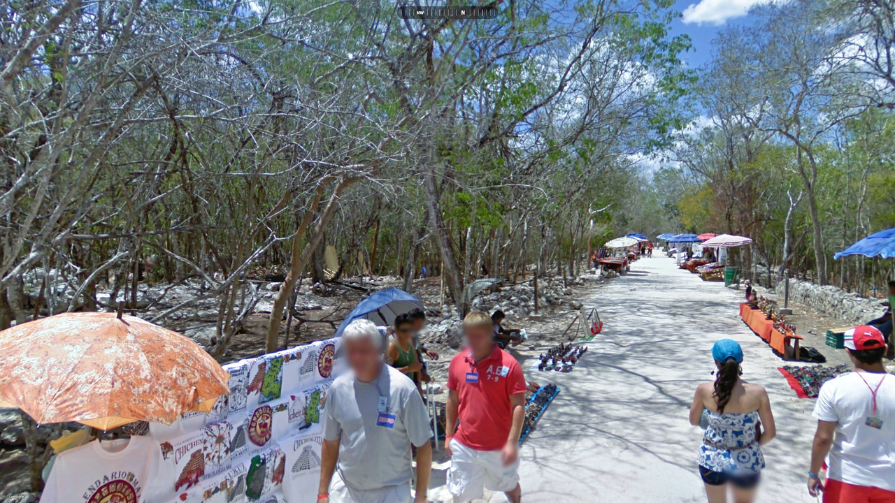
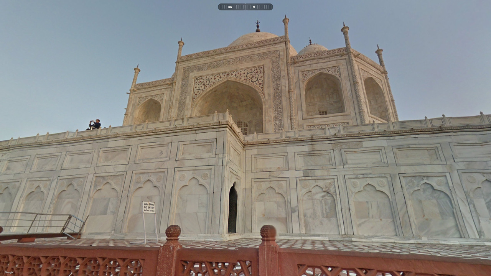
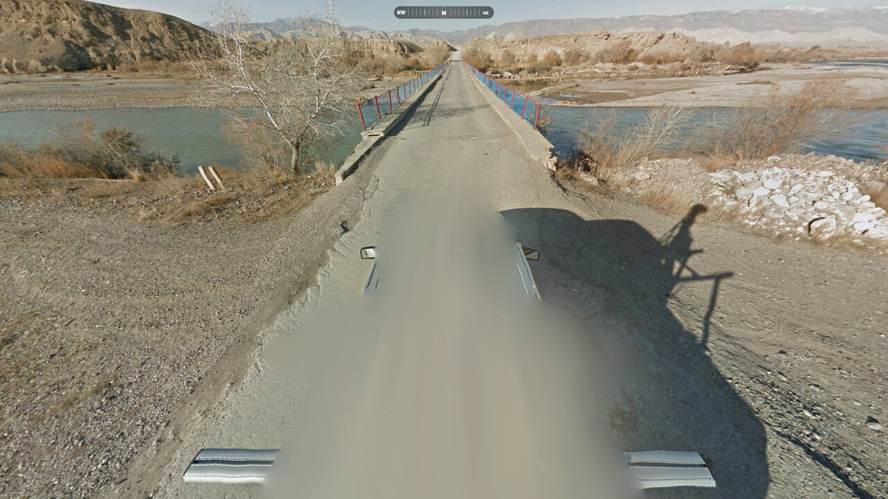

## `oh-the-places-youll-go` -- a "Geo Detective" inspired challenge
---

## Part 1

The first 11 images show portions of some of the most famous landmarks in the world, as captured by official Google Street View coverage. The compass heading at the top of the image indicates the general direction of the landmark. Using the approximate scale of the structure you can estimate the distance. In case more than one road is compatible, the correct one can easily be identified after a brief inspection. The exact location can then be pinpointed thanks to the various items and features portrayed. Many of the images use numbers located on objects like people or advertisements, which are transient. As such, you often must locate the exact image in Street View. Once all locations have been found, the world "CALL" and a phone number can be assembled from the map.

`map.jpg` - The clue for how to assemble the hidden message from each image

`img_0001.jpg` - New York, facing Time Square -- "call" in "calling"

[Link to Google Maps](https://www.google.com/maps/@40.7576889,-73.9858065,3a,83.3y,29.16h,116.05t/data=!3m7!1e1!3m5!1suW_eUGvspzGFVjN_Vy2vfQ!2e0!6shttps:%2F%2Fstreetviewpixels-pa.googleapis.com%2Fv1%2Fthumbnail%3Fcb_client%3Dmaps_sv.tactile%26w%3D900%26h%3D600%26pitch%3D-26.047572807065833%26panoid%3DuW_eUGvspzGFVjN_Vy2vfQ%26yaw%3D29.157001408725435!7i16384!8i8192?entry=ttu&g_ep=EgoyMDI1MDQwOC4wIKXMDSoASAFQAw%3D%3D)

`img_0002.jpg` - Rome, facing the Colosseum -- "8" in "2018"

[Link to Google Maps](https://www.google.com/maps/place/S.+Gregorio/@41.8922026,12.4904373,3a,75y,184.95h,83.77t/data=!3m7!1e1!3m5!1swv8qEZM8bxd4nO7CORdgbQ!2e0!6shttps:%2F%2Fstreetviewpixels-pa.googleapis.com%2Fv1%2Fthumbnail%3Fcb_client%3Dmaps_sv.tactile%26w%3D900%26h%3D600%26pitch%3D6.226083335339922%26panoid%3Dwv8qEZM8bxd4nO7CORdgbQ%26yaw%3D184.95013306142448!7i16384!8i8192!4m6!3m5!1s0x132f61b60285dc37:0x566e3a2693bd021d!8m2!3d41.8875048!4d12.4901711!16s%2Fg%2F12vsgzzml?entry=ttu&g_ep=EgoyMDI1MDQwNy4wIKXMDSoASAFQAw%3D%3D)

`img_0003.jpg` - Paris, facing the Eiffel Tower -- "0" in "30"

[Link to Google Maps](https://www.google.com/maps/@48.856967,2.2919587,3a,75y,56.2h,73.53t/data=!3m7!1e1!3m5!1s7MNBZyPxAuHxLFDXgBJcPg!2e0!6shttps:%2F%2Fstreetviewpixels-pa.googleapis.com%2Fv1%2Fthumbnail%3Fcb_client%3Dmaps_sv.tactile%26w%3D900%26h%3D600%26pitch%3D16.466109134130335%26panoid%3D7MNBZyPxAuHxLFDXgBJcPg%26yaw%3D56.19639256096559!7i16384!8i8192?entry=ttu&g_ep=EgoyMDI1MDQwNy4wIKXMDSoASAFQAw%3D%3D)

`img_0004.jpg` - London, facing the Tower Bridge -- "1" in tractor serial number

[Link to Google Maps](https://www.google.com/maps/@51.5070572,-0.0757421,3a,75.4y,154.09h,104.47t/data=!3m7!1e1!3m5!1sUpvOHBL_dHPIaRf3Wmdo0Q!2e0!6shttps:%2F%2Fstreetviewpixels-pa.googleapis.com%2Fv1%2Fthumbnail%3Fcb_client%3Dmaps_sv.tactile%26w%3D900%26h%3D600%26pitch%3D-14.470301520502716%26panoid%3DUpvOHBL_dHPIaRf3Wmdo0Q%26yaw%3D154.0854114789515!7i16384!8i8192?entry=ttu&g_ep=EgoyMDI1MDQwOC4wIKXMDSoASAFQAw%3D%3D)

`img_0005.jpg` - Chichén Itzá, facing a vendor on the north/south market road -- 9 on t-shirt

[Link to Google Maps](https://www.google.com/maps/@20.6855829,-88.5681538,3a,75y,324.79h,70.23t/data=!3m7!1e1!3m5!1srjlSLJn8CmXSs_O63QLNfA!2e0!6shttps:%2F%2Fstreetviewpixels-pa.googleapis.com%2Fv1%2Fthumbnail%3Fcb_client%3Dmaps_sv.tactile%26w%3D900%26h%3D600%26pitch%3D19.77258179863219%26panoid%3DrjlSLJn8CmXSs_O63QLNfA%26yaw%3D324.785484721884!7i13312!8i6656?entry=ttu&g_ep=EgoyMDI1MDQwNi4wIKXMDSoASAFQAw%3D%3D)

`img_0006.jpg` - Giza Necropolis, facing the Great Sphinx -- "zero" on Coke Zero

[Link to Google Maps](https://www.google.com/maps/@29.975454,31.1389447,2a,90y,272.66h,79.5t/data=!3m7!1e1!3m5!1s6ewxCJI3yR9TEFlSrKChrw!2e0!6shttps:%2F%2Fstreetviewpixels-pa.googleapis.com%2Fv1%2Fthumbnail%3Fcb_client%3Dmaps_sv.tactile%26w%3D900%26h%3D600%26pitch%3D10.497760982264126%26panoid%3D6ewxCJI3yR9TEFlSrKChrw%26yaw%3D272.65777164840256!7i13312!8i6656?entry=ttu&g_ep=EgoyMDI1MDQwNi4wIKXMDSoASAFQAw%3D%3D)

`img_0007.jpg` - San Francisco, Market Street facing the Ferry Building -- "one" in "one way"

[Link to Google Maps](https://www.google.com/maps/@37.7929636,-122.3968152,3a,74y,44.2h,92.6t/data=!3m7!1e1!3m5!1s8W6HqxG5dAhi4WWBNdYuPQ!2e0!6shttps:%2F%2Fstreetviewpixels-pa.googleapis.com%2Fv1%2Fthumbnail%3Fcb_client%3Dmaps_sv.tactile%26w%3D900%26h%3D600%26pitch%3D-2.6001081171146723%26panoid%3D8W6HqxG5dAhi4WWBNdYuPQ%26yaw%3D44.202151997949365!7i16384!8i8192?entry=ttu&g_ep=EgoyMDI1MDQwNi4wIKXMDSoASAFQAw%3D%3D)

`img_0008.jpg` - Dharmapuri, facing the Taj Mahal -- "O" in "NO ENTRY"

[Link to Google Maps](https://www.google.com/maps/@27.1744571,78.0422471,2a,45y,324.22h,92.15t/data=!3m7!1e1!3m5!1s-cCtXZDBsQ8dZPSi_jI2Aw!2e0!6shttps:%2F%2Fstreetviewpixels-pa.googleapis.com%2Fv1%2Fthumbnail%3Fcb_client%3Dmaps_sv.tactile%26w%3D900%26h%3D600%26pitch%3D-2.1506750902047713%26panoid%3D-cCtXZDBsQ8dZPSi_jI2Aw%26yaw%3D324.2230564598831!7i13312!8i6656?entry=ttu&g_ep=EgoyMDI1MDQwNi4wIKXMDSoASAFQAw%3D%3D)

`img_0009.jpg` - Tokyo, inside the Shibuya Scramble Crossing -- 8 in "Ushi8"

[Link to Google Maps](https://www.google.com/maps/@35.6594944,139.7007025,3a,66.8y,295.85h,107.88t/data=!3m7!1e1!3m5!1sRaNoutOgDdz7nABPid3adw!2e0!6shttps:%2F%2Fstreetviewpixels-pa.googleapis.com%2Fv1%2Fthumbnail%3Fcb_client%3Dmaps_sv.tactile%26w%3D900%26h%3D600%26pitch%3D-17.882381664348273%26panoid%3DRaNoutOgDdz7nABPid3adw%26yaw%3D295.85088149921233!7i16384!8i8192!4m6!3m5!1s0x60188bcaeb0cd12b:0x20e563a2e0aec969!8m2!3d35.659482!4d139.7005596!16s%2Fg%2F11shy4scrj?entry=ttu&g_ep=EgoyMDI1MDQwOC4wIKXMDSoASAFQAw%3D%3D)

`img_0010.jpg` - Sydney, facing the Opera House -- "3" in "3.6m"

[Link to Google Maps](https://www.google.com/maps/@-33.8576952,151.2142861,2a,23.5y,77.86h,109.47t/data=!3m10!1e1!3m8!1smH57MBnD6z1VusFNzvrEoA!2e0!6shttps:%2F%2Fstreetviewpixels-pa.googleapis.com%2Fv1%2Fthumbnail%3Fcb_client%3Dmaps_sv.tactile%26w%3D900%26h%3D600%26pitch%3D-19.46639854156443%26panoid%3DmH57MBnD6z1VusFNzvrEoA%26yaw%3D77.85527896648036!7i13312!8i6656!9m2!1b1!2i27?entry=ttu&g_ep=EgoyMDI1MDQwNy4wIKXMDSoASAFQAw%3D%3D)

`img_0011.jpg` - Las Vegas, facing The Flamingo -- "4" in "$5.49"

[Link to Google Maps](https://www.google.com/maps/@36.1154347,-115.1727489,3a,75y,81.89h,96.8t/data=!3m7!1e1!3m5!1sOKVQSiS-NwCtb3Rq6Z6VHg!2e0!6shttps:%2F%2Fstreetviewpixels-pa.googleapis.com%2Fv1%2Fthumbnail%3Fcb_client%3Dmaps_sv.tactile%26w%3D900%26h%3D600%26pitch%3D-6.795093560444371%26panoid%3DOKVQSiS-NwCtb3Rq6Z6VHg%26yaw%3D81.885777192817!7i13312!8i6656?entry=ttu&g_ep=EgoyMDI1MDQwOC4wIKXMDSoASAFQAw%3D%3D)

---

## Part 2

As opposed to part 1, where your goal was to first find locations and then uncover some masked information, getting the various spots' coordinates is sufficient to solve part 2. However, this second batch of images features no important landmark; as such, these locations are much harder to pinpoint. You're given an example of how to assemble the flag:

This image depicts how to assemble the flag: take the first two digits after the decimal point for the longitude and latitude to produce 4 flag digits.

The true flag shows 12 thumbnail images, which results in a total length of 48 unknown decimal digits players must find:

Each of these locations can be unambiguously pinpointed. To do so, players must draw on country-specific features, as well as knowledge of Google Maps coverage (for example, the so called "car meta"). Each location has been selected so that players mildly experienced with "Geo Guessing" will immediately know the country. With the country determined, other visible clues like road direction, coastline, business names, road markers, etc. can be used to pinpoint the exact location. Inexperienced players can anyway lean on searching the web and consulting major "Geo Guessing" resources, like the [Plonk It](https://www.plonkit.net/guide) guide, or the [GeoHints](https://geohints.com/) database.

## `img_1001.jpg` -- Portugal -- `@38.6895653,-9.1769822` -- **6817**

Country indicators:
- White European long-plate bordered by blue and yellow

The image features several European plates (long, blue vertical line on the left-hand side). Importantly, the plates also sport a yellow vertical strip on the right-hand side; this uniquely identifies Portugal. The compass reveals that the suspension bridge we're on is largely-aligned north-south. The longest bridge of this kind in Portugal is Ponte 25 de Abril, just south of Lisbon; to further confirm the location, the left arm of the Christ the King monument is also visible on the further left of the image. Players can then locate the exact spot on the bridge by lining up the tie-rods and the vehicles traveling around the Google car, especially the motorcycle which is perfectly aligned on the center of the road.

[Link to Google Maps](https://www.google.com/maps/@38.6895653,-9.1769822,3a,75y,201.6h,87.9t/data=!3m7!1e1!3m5!1sxOe0UnuvKOVRm8CkmT8MWg!2e0!6shttps:%2F%2Fstreetviewpixels-pa.googleapis.com%2Fv1%2Fthumbnail%3Fcb_client%3Dmaps_sv.tactile%26w%3D900%26h%3D600%26pitch%3D2.102479664353396%26panoid%3DxOe0UnuvKOVRm8CkmT8MWg%26yaw%3D201.5965069220882!7i16384!8i8192?entry=ttu&g_ep=EgoyMDI1MDQwOS4wIKXMDSoASAFQAw%3D%3D)

## `img_1002.jpg` -- Kyrgyzstan -- `@41.4273437,75.0332914` -- **4203**

Country indicators:
- Landscape
- Unique Google car with rack and mirrors visible

The image prominently features a silver truck with a rack; the only deserty country that has been captured by this style of Google car is Kyrgyzstan. We're hence looking for a perfectly north-south small bridge in a non-urban area. Using these clues, the mountain chain in the north, and the fact that Kyrgyzstan coverage is extremely limited, players should quickly identify the correct bridge, which is located on the Naryn river, approximately at the center of the country. The location can further be confirmed by the peculiar blue and red color of the barriers.

[Link to Google Maps](https://www.google.com/maps/@41.4273437,75.0332914,3a,75y,7.09h,60.6t/data=!3m7!1e1!3m5!1s-7n4BkV4-iPWDSvv2-zQAw!2e0!6shttps:%2F%2Fstreetviewpixels-pa.googleapis.com%2Fv1%2Fthumbnail%3Fcb_client%3Dmaps_sv.tactile%26w%3D900%26h%3D600%26pitch%3D29.39953907190302%26panoid%3D-7n4BkV4-iPWDSvv2-zQAw%26yaw%3D7.086671441781004!7i13312!8i6656?entry=ttu&g_ep=EgoyMDI1MDQwOS4wIKXMDSoASAFQAw%3D%3D)

## `img_1003.jpg` -- Isle of Man -- `@54.0842611,-4.6959922` -- **0869**

Country indicators:
- Driving left
- Yellow European long plate with red on left

The image shows a car driving on the left-hand side of the road; this, coupled with the yellow back-plate and the sun being south, uniquely identifies the British Isles. This is further confirmed by the typical wet landscape and the stone-made structures. Among these islands, the only one that uses a red vertical strip on the left-hand side of the plate is the Isle of Man. From the position of the water, as indicated by the compass, we can infer that the Google car is traveling on the southern coastline, very close to the sea. This leaves players with only a couple of viable spots in the – already very tiny – country; briefly inspecting these, and lining up the shoreline's features, lets us pinpoint the correct location on the A5.

[Link to Google Maps](https://www.google.com/maps/@54.0842611,-4.6959922,3a,75y,141.47h,77.47t/data=!3m7!1e1!3m5!1sZPzjy9pG3yxAkOsg9eE0uw!2e0!6shttps:%2F%2Fstreetviewpixels-pa.googleapis.com%2Fv1%2Fthumbnail%3Fcb_client%3Dmaps_sv.tactile%26w%3D900%26h%3D600%26pitch%3D12.52569889737542%26panoid%3DZPzjy9pG3yxAkOsg9eE0uw%26yaw%3D141.47210417915278!7i13312!8i6656?entry=ttu&g_ep=EgoyMDI1MDQwOS4wIKXMDSoASAFQAw%3D%3D)

## `img_1004.jpg` -- Iceland -- `@64.7883182,-14.4895161` -- **7848**

Country indicators:
- Yellow road indicators with diagonal top cut and white reflector (aka "bollards")

The image features several yellow road indicators ("bollards") with a slanted top; these are unique to Iceland. Using the compass, players can infer that the Google car is travelling on a long north-east bridge prominently curves right through a full quarter-circle. The only spot with the correct structural features, as revealed by a bird-eye inspection of the sparsely-covered Icelandic map, is the section of the Hringvegur road that crosses the Berufjörður fjord. The exact location can be pinpointed by lining up the roadsign on the left-hand side, and the portion of the road where the asphalt changes color.

[Link to Google Maps](https://www.google.com/maps/@64.7883182,-14.4895161,3a,75y,39.61h,83.04t/data=!3m7!1e1!3m5!1sHF5TmiK8gmGtwUbuyAZbCg!2e0!6shttps:%2F%2Fstreetviewpixels-pa.googleapis.com%2Fv1%2Fthumbnail%3Fcb_client%3Dmaps_sv.tactile%26w%3D900%26h%3D600%26pitch%3D6.963626582018591%26panoid%3DHF5TmiK8gmGtwUbuyAZbCg%26yaw%3D39.61112281195068!7i16384!8i8192?entry=ttu&g_ep=EgoyMDI1MDQwOS4wIKXMDSoASAFQAw%3D%3D)

## `img_1005.jpg` -- Guatemala -- `@14.487069,-90.5260302` -- **4852**

Country indicators:
- Unique Google car with rack and mirrors visible
- Green utility pole with location sticker

The image features a grey Street View car with a rack and side mirrors. This vehicle, coupled with the green utility pole, uniquely identifies Guatemala. The white plate on the pole displays two characters on its upper portion, "M0", which [determine the road we're on](https://images.squarespace-cdn.com/content/v1/60f6054f4e76b03092956de8/f360e8d3-29b4-42a7-bf9d-463c766ab1ef/gt_poleplate.png?format=2500w). The exact location is then specified by the three digits on the lower portion of the plate, "032". These numbers are sequential along the road, allowing players to narrow down the section quite easily.

[Link to Google Maps](https://www.google.com/maps/@14.487069,-90.5260302,3a,75y,177.04h,61.95t/data=!3m7!1e1!3m5!1sxGq_MZ8__Wva53yCIRpfqg!2e0!6shttps:%2F%2Fstreetviewpixels-pa.googleapis.com%2Fv1%2Fthumbnail%3Fcb_client%3Dmaps_sv.tactile%26w%3D900%26h%3D600%26pitch%3D28.049310769779574%26panoid%3DxGq_MZ8__Wva53yCIRpfqg%26yaw%3D177.04157945948396!7i13312!8i6656?entry=ttu&g_ep=EgoyMDI1MDQwOS4wIKXMDSoASAFQAw%3D%3D)

## `img_1006.jpg` -- Malta -- `@35.9017928,14.516686` -- **9051**

Country indicators:
- Driving left
- White European front plates with blue on left
- White square backplate with blue in top left (barely visible)
- "Italian-style" buildings made out of limestone
- Malta bus stop sign

The image shows several cars driving and parked on the left-hand side of the road, all using white European front-plates (long, blue vertical line on the left-hand side); this, coupled with the sunny environment and the limestone buildings, uniquely identifies the small island of Malta. The dense urban setting with a prominent church dome in the distance (Basilica of Our Lady of Mount Carmel), the position of the coastline, and of the land visible across the water, easily point to St. Elmo Place in Valletta, Malta's capital.

[Link to Google Maps](https://www.google.com/maps/@35.9017928,14.516686,3a,73.2y,259.08h,82.89t/data=!3m7!1e1!3m5!1szHGS_pqQ5-Yxsxxqo48z6Q!2e0!6shttps:%2F%2Fstreetviewpixels-pa.googleapis.com%2Fv1%2Fthumbnail%3Fcb_client%3Dmaps_sv.tactile%26w%3D900%26h%3D600%26pitch%3D7.106785215160116%26panoid%3DzHGS_pqQ5-Yxsxxqo48z6Q%26yaw%3D259.08164220572974!7i16384!8i8192?entry=ttu&g_ep=EgoyMDI1MDQwOC4wIKXMDSoASAFQAw%3D%3D)

## `img_1007.jpg` -- Oman -- `@23.2648087,58.9252482` -- **2692**

Country indicators:
- Unique Google car with rack visible
- Long golden-yellow back-plate
- Landscape

The image features a white pickup truck with distinct black bolted racks. Together with the deserty-marine landscape, the yellow plate, and the black and white striped pole on the left-hand side of the image, this uniquely points to Oman. The position of the water, as displayed by the compass, indicates that we are traveling on the east coast of the country. The boats and the man-made structures in the water show that we are next to an artificial fishing bay, whose two barriers do not cross each other. This uniquely identifies the Qurayyat marina. The exact location can then be pinpointed by lining up the boats and the beach umbrella.

[Link to Google Maps](https://www.google.com/maps/@23.2648087,58.9252482,3a,90y,57.41h,74.85t/data=!3m7!1e1!3m5!1s1R5VRWHCrAcuYx61g_UF-w!2e0!6shttps:%2F%2Fstreetviewpixels-pa.googleapis.com%2Fv1%2Fthumbnail%3Fcb_client%3Dmaps_sv.tactile%26w%3D900%26h%3D600%26pitch%3D15.150504005897744%26panoid%3D1R5VRWHCrAcuYx61g_UF-w%26yaw%3D57.40665071207248!7i16384!8i8192?entry=ttu&g_ep=EgoyMDI1MDQwOS4wIKXMDSoASAFQAw%3D%3D)

## `img_1008.jpg` -- San Marino -- `@43.9706272,12.4825187` -- **9748**

Country indicators:
- Italian language
- Blue & white crosswalk with hanging pedestrian signs
- Red on yellow chevrons (looks washed out and more white in image)

Indicators of proximity to Italy:
- Short white Italian-style front-plate bordered by blue on both sides
- Long white European back-plate bordered by blue on both sides

The image shows several cars using European plates driving right. Some of them use a double blue strip, while the black truck in the distance features Italian language on its back doors – "TecnoArredo". All of these clues, together with the hilly green landscape, point to the fact that we are close to Italy. The peculiar style of the pedestrian crossing, with painted blue crosswalks and hanging signs, and the red on yellow chevrons, uniquely identify San Marino. The exact location can be pinpointed via a Google search of the name of the business on the right, together with the country name – "mvpsport san marino"; it is located on the Superstrada, the only divided road in the country, on one of its very few north-west sections. Alternatively, a search for "MVPsport Europe" turns up a few locations which can be quickly checked to identify the San Marino one.

[Link to Google Maps](https://www.google.com/maps/@43.9706272,12.4825187,3a,31.5y,348.06h,90.51t/data=!3m7!1e1!3m5!1slXrShcxLr4G4LUItMs-VeQ!2e0!6shttps:%2F%2Fstreetviewpixels-pa.googleapis.com%2Fv1%2Fthumbnail%3Fcb_client%3Dmaps_sv.tactile%26w%3D900%26h%3D600%26pitch%3D-0.5115744900562902%26panoid%3DlXrShcxLr4G4LUItMs-VeQ%26yaw%3D348.0551894805283!7i16384!8i8192?entry=ttu&g_ep=EgoyMDI1MDQwOS4wIKXMDSoASAFQAw%3D%3D)

## `img_1009.jpg` -- Senegal -- `@14.1527636,-16.8297142` -- **1582**

Country indicators:
- Long blue front-plates
- Back of Google vehical visible
- African people & style of dress

The image shows several people, some wearing African style of clothes. Among African countries, Senegal is the only covered country that uses blue license plates. The location is further confirmed by the dry climate, and the back portion of the Google car, a white pickup truck. Eagle-eyed players may also spot a small Senegal flag flown on a boat in the center of the image. The specific spot chosen is rather peculiar, as it features a long south-east pedestrian bridge connecting the mainland to a small inhabited island. A birds-eye inspection of the Senegal map, coupled with the somewhat sparse coverage of the country, allows players to easily identify the location as the bay south of Joal Fadiout.

[Link to Google Maps](https://www.google.com/maps/@14.1527636,-16.8297142,3a,75y,149.18h,61.72t/data=!3m7!1e1!3m5!1sidj0dsaSYEv1D7sEIPkCbg!2e0!6shttps:%2F%2Fstreetviewpixels-pa.googleapis.com%2Fv1%2Fthumbnail%3Fcb_client%3Dmaps_sv.tactile%26w%3D900%26h%3D600%26pitch%3D28.283720467437085%26panoid%3Didj0dsaSYEv1D7sEIPkCbg%26yaw%3D149.17642871365416!7i16384!8i8192!4m6!3m5!1s0xe95028d30b8b5d3:0x837b0d2f2bc66f2!8m2!3d16.5110902!4d-15.8114879!16zL20vMDdieHBz?entry=ttu&g_ep=EgoyMDI1MDQwOS4wIKXMDSoASAFQAw%3D%3D)

## `img_1010.jpg` -- Colombia -- `@10.0453874,-75.2587667` -- **0425**

Country indicators:
- Cross on back of sign (so-called "colo cross")
- Colombian kilometer marker with highway number
- Landscape

The left portion of the image shows the back of a signpost displaying a distinct metal cross, and a vertical green kilometer marker; both of these features are unique to Colombia (the former is known in the "Geo Guessing" community as the "Colo cross"). The location is further confirmed by the tropical landscape. The first two digits on the lower portion of the kilometer marker indicate the road number – "90". The exact location can then be pinpointed by traveling on highway 90 and finding the sign marked with a vertical "49"; the task is relatively easy, as the numbers are sequential.

[Link to Google Maps](https://www.google.com/maps/@10.0453874,-75.2587667,3a,63.7y,37.52h,82.57t/data=!3m7!1e1!3m5!1sMCjI0Ygw7I_wxnjdNI3WQQ!2e0!6shttps:%2F%2Fstreetviewpixels-pa.googleapis.com%2Fv1%2Fthumbnail%3Fcb_client%3Dmaps_sv.tactile%26w%3D900%26h%3D600%26pitch%3D7.42825048863628%26panoid%3DMCjI0Ygw7I_wxnjdNI3WQQ%26yaw%3D37.524956273775786!7i16384!8i8192?entry=ttu&g_ep=EgoyMDI1MDQwOS4wIKXMDSoASAFQAw%3D%3D)

## `img_1011.jpg` -- Réunion -- `@-20.8759326,55.4441705` -- **8744**

Country indicators:
- Sun north
- White European front plates with blue on left
- Unique Google car with racks visible (black tape on right-rear rack)

The image features multiple European plates (long, blue vertical line on the left-hand side); importantly, however, the sun is north, which means we are in the southern hemisphere, and hence far from geographic Europe. The image also shows a Street View car with a roof rack, and black tape on the right rear bar. All of these clues uniquely identify Réunion Island, an overseas department of France. Using the compass, players can determine that we're traveling on the north coast and, specifically, that we are on a small north-east bridge. This easily points to Rivière Saint-Denis bridge.

[Link to Google Maps](https://www.google.com/maps/@-20.8759326,55.4441705,3a,90y,4.11h,57.64t/data=!3m7!1e1!3m5!1sXl-RfsWYysso5PZoirFmtw!2e0!6shttps:%2F%2Fstreetviewpixels-pa.googleapis.com%2Fv1%2Fthumbnail%3Fcb_client%3Dmaps_sv.tactile%26w%3D900%26h%3D600%26pitch%3D32.36296772423777%26panoid%3DXl-RfsWYysso5PZoirFmtw%26yaw%3D4.11245970240398!7i13312!8i6656?entry=ttu&g_ep=EgoyMDI1MDQwOC4wIKXMDSoASAFQAw%3D%3D)

## `img_1012.jpg` -- St. Croix (US Virgin Islands) -- `@17.6950798,-64.7635519` -- **6976**

Country indicators:
- Unique red Google car with rack and mirrors visible
- North American style short back-plate
- Landscape

The image prominently features a saturated red Google car with a rack; the car on the right shows a short bright blue license plate. These characteristics uniquely identify the US Virgin Islands. Furthermore, the red truck can only be seen on the island of St. Croix. From the compass, players can infer we are on the southern coast, at a boat ramp, which has extremely limited coverage; the exact location can be found using the distinct strip of land on the right portion of the image, which protrudes south into the ocean.

[Link to Google Maps](https://www.google.com/maps/@17.6950798,-64.7635519,3a,75y,190.12h,72.98t/data=!3m7!1e1!3m5!1sWHvMaVaizYt3z_ve7Fhh_w!2e0!6shttps:%2F%2Fstreetviewpixels-pa.googleapis.com%2Fv1%2Fthumbnail%3Fcb_client%3Dmaps_sv.tactile%26w%3D900%26h%3D600%26pitch%3D17.017473946452427%26panoid%3DWHvMaVaizYt3z_ve7Fhh_w%26yaw%3D190.1235820308217!7i13312!8i6656!4m4!3m3!8m2!3d37.336663!4d-121.891094?entry=ttu&g_ep=EgoyMDI1MDQwOS4wIKXMDSoASAFQAw%3D%3D)

---

Putting all these together yields the flag.

