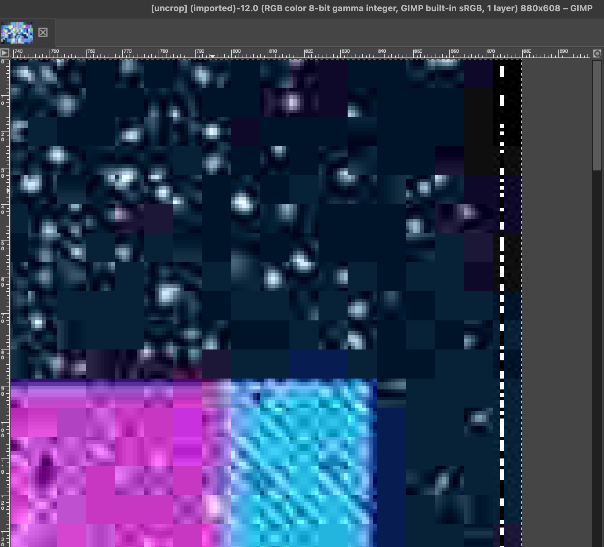

JPEG compression stores pixels in 8x8 blocks. This means that even if the image size isn't a multiple of 8 in width or height it actually stores information about the extra "slack" pixels. Editors use many different strategies for padding out the image to a muliple of 8. In the provided flag the strategy used is just to extend the last row or column of pixels however many additional rows/columns are needed.

The slackblock-steg program makes use of these extra hidden pixels to encode the key and message in binary, one bit per pixel, using black for 0 and white for 1.

To solve, first extend the image size out to the true padded size:

    $ ./jpeg_uncrop.py ../distfiles/flag.jpg
    Width: 874, Height: 605

Then you can read the encoded key and message directly out of the pixels.

The data is encoded as:

* 2 bytes: '88' (the two ASCII letters in binary)
* 1 byte: key length
* n bytes: key bytes
* 1 byte: message length
* n bytes: message bytes

The key to the image is the flag. One way to solve is to just black-out the 8 key-size bits and then to write a longer length for the following byte so that the tool will accept a blank key and decode the remaining partial key + message length + message as the message. This will display the flag (minus the C which was overwritten) and the mesage together.

Flag:

CTF{slack_space_not_just_for_filesystems}
